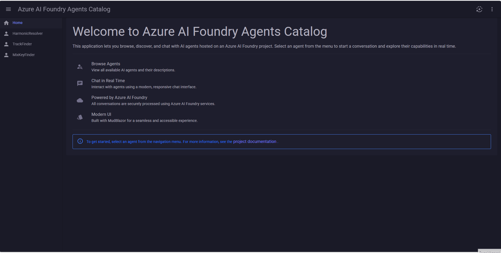
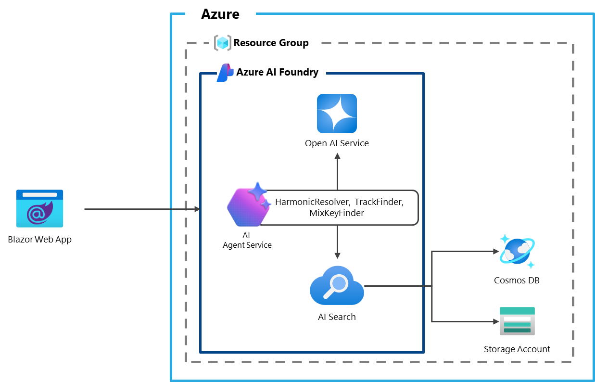

# Blazor-Azure-AI-Foundry-Agents-Catalog
A Blazor front-end application that dynamically catalogs agents hosted in Azure AI Foundry, enabling real-time chat interactions through a MudBlazor UI.

This project demonstrates how to integrate Azure AI Foundry and Azure AI Agent Service into a .NET 9 application using Blazor WebAssembly Hosted. 

## Table of contents

- [Key Features](#key-features)
- [Solution Architecture](#solution-architecture)
  - [Server Responsibilities](#server-responsibilities)
  - [Extensibility Thoughts](#extensibility-thoughts)
- [Demo](#demo)
  - [Demo Scope](#dart-demo-scope)
    - [HarmonicResolver Agent](#mag-harmonicresolver-agent)
    - [TrackFinder Agent](#cd-trackfinder-agent)
    - [MixKeyFinder Agent](#musical_score-mixkeyfinder-agent)
- [Prerequisites](#prerequisites)
- [Resoursces](#resources)

## Key Features
The Blazor WebAssembly frontend provides a modern and responsive interface to interact with the agents:

- **Dynamic Navigation Menu**: One entry per agent, generated at runtime.
- **Real-Time Chat:** Interact with any agent using a modern chat interface, supporting Markdown (including tables and links).
- **Isolated Conversations:** Each agent starts a new conversation context upon selection (no chat history).
- **Azure AI Foundry Integration:** All chat and agent data is managed via Azure AI Foundry APIs, with server-side credential handling.
- **Responsive UI:** Built with MudBlazor, the app adapts to desktop and mobile devices, and supports light/dark themes.
- **Markdown rendering:** Agent responses can include source links or tables, which are rendered as HTML in the MudBlazor's chat components.

## Solution Architecture

This solution is designed to reflect a near real-world architecture with a clear separation of concerns between client and server components:

- **BlazorAIFoundryAgentsCatalog.Client**: This is the client-side Blazor WebAssembly (WASM) application that runs in the browser.
- **BlazorAIFoundryAgentsCatalog**: This is the server-side project that hosts the client app and can also expose server-side APIs.

### Server Responsibilities

The server project (`BlazorAIFoundryAgentsCatalog`) includes:

- Dedicated service classes to handle interactions with external services such as Azure AI Foundry and Azure AI Agent Service.
- API endpoints exposed via controllers, which are consumed by the Blazor WASM client using `HttpClient`.

### Extensibility Thoughts

This architecture allows for flexible deployment scenarios. For example, the Azure AI Foundry interactions could be hosted remotely on a separate service such as Azure App Service or Azure Functions, enabling a more distributed and scalable solution.

> This structure promotes maintainability, scalability, and a clean separation of responsibilities.

## Demo
> **Note:** The below demo is provided solely as an example. The configuration of the agents used in the demo is not included in this repository.



### :dart: Demo Scope

The above demo shows three specialized agents, each hosted in the same Azure AI Foundry project:

#### :mag: HarmonicResolver Agent

- Enables natural language exploration of a large music dataset indexed in Azure AI Search.
- Responds to queries like "Find tracks in 128 BPM with Camelot key 8A".
- Returns structured metadata: Artist, Title, BPM, Musical Key, and Camelot Key.
- Data source: a CSV file with over 20,000 rows, stored in Azure Blob Storage.

#### :cd: TrackFinder Agent

- Searches a personal CD library using an index built from Word and PDF documents.
- Each document represents a CD tracklist stored in Azure Blob Storage.
- Returns: CD Title, Folder Name, and Track Position.

#### :musical_score: MixKeyFinder Agent

- Acts as a DJ assistant for harmonic mixing.
- Identifies compatible Camelot keys based on harmonic mixing theory.
- Data is stored in Azure Cosmos DB (NoSQL) and indexed in Azure AI Search.


>The simplified architecture diagram below illustrates how these agents interact with Azure services and the Blazor frontend.



---

## Prerequisites
To run this project, you will need:
- [.NET 9 SDK](https://dotnet.microsoft.com/download/dotnet/9.0)
- An [Azure account](https://azure.microsoft.com/)
- Azure subscription with an Azure AI Foundry project containing at least one agent deployed

## Running This Sample
1. Open the solution in Visual Studio or Visual Studio Code
2. Fill in your Endpoint for Azure AI Foundry in `appsettings.Development.json`

    ```json
    "AzureAIFoundry": {
        "EndpointUrl": "{YOUR-AZUREAIFOUNDRY-ENDPOINT}"
    }
    ```
3. Using Visual Studio
    - Press F5, or select the `Debug > Start Debugging` menu in Visual Studio

4. Using the .NET CLI from the terminal (e.g. from Visual Studio Code terminal)
    - `dotnet run --project BlazorAIFoundryAgentsCatalog`

The app will be available at: http://localhost:5147

## Resources
- [Azure AI Foundry Documentation](https://learn.microsoft.com/en-us/azure/ai-foundry/what-is-azure-ai-foundry)
- [Azure AI Projects client library for .NET part of Azure AI Foundry SDK](https://learn.microsoft.com/en-us/dotnet/api/overview/azure/ai.projects-readme?view=azure-dotnet-preview)
- [Azure AI Agent Service Documentation](https://learn.microsoft.com/en-us/azure/ai-foundry/agents/overview)
- [Azure AI Persistent Agents client library for .NET](https://learn.microsoft.com/en-us/dotnet/api/overview/azure/ai.agents.persistent-readme?view=azure-dotnet)
- [MudBlazor](https://mudblazor.com/): Blazor component library
  - This project was created using MudBlazor's template by following the official documentation: [Get Started Using Templates](https://mudblazor.com/getting-started/installation#using-templates)
- [Markdig](https://github.com/xoofx/markdig): Markdown processor for .NET
